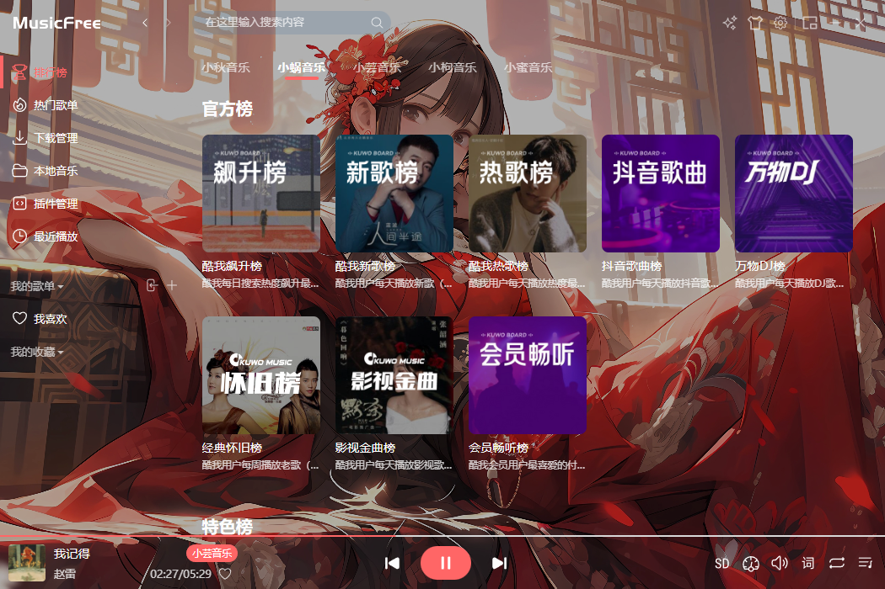
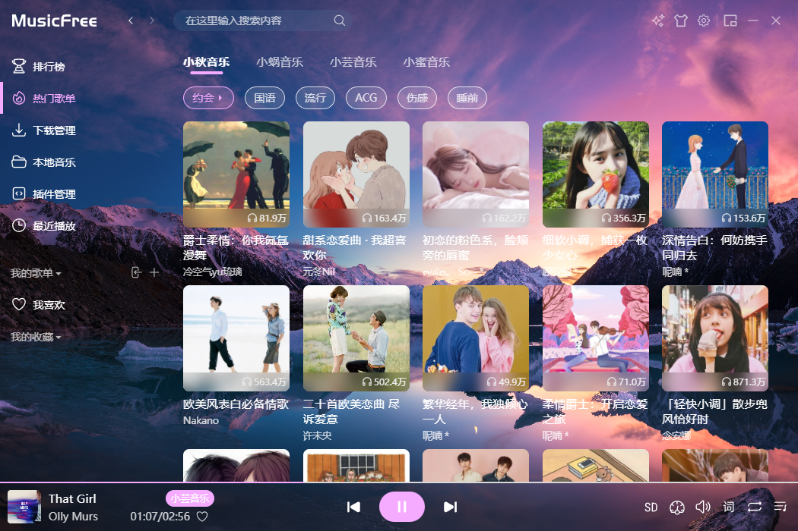

# MusicFree 桌面版的主题包

本项目只是个人学习记录一下，后续会不定时更新！如果你喜欢请点个star，谢谢~ 🍓💖😀
<br><br>

## 播放器下载

MusicFreeDesktop桌面版
<a href = "https://github.com/maotoumao/MusicFreeDesktop/releases/latest">官网下载</a>&nbsp;&nbsp;&nbsp;&nbsp;
<a href = "https://www.123pan.com/s/gbitVv-rSfzH.html">123云盘</a>&nbsp;&nbsp;&nbsp;&nbsp;
<a href = "https://wwf.lanzoub.com/i7zQQ23sbeqf">蓝奏云[密码123123]</a>
<br><br>

## 使用方法

1. 下载<a href = "https://github.com/Hopelsz/MyselfMusicFreeThemePacks/releases/latest">主题包</a>并解压

2. 点击 + 号安装主题，安装解压文件夹内的 .mftheme 文件（可以多选）

3. 软件内切换主题即可
   <br><br>

## 效果 ❤️‍🔥

<details>
<summary style="cursor: pointer;">点击展开</summary>

- 黑红主题【black-red】<br>
  
  
  <br><br>

- 幻想世界【fantasy-world】<br>
  
  
  <br><br>

- 红娘主题【matchmaker】<br>
  
  
  <br><br>

- 海盗主题【pirate-boat】<br>
  
  
  <br><br>

- 晚霞主题【sunset-glow】<br>
  
  
  <br><br>

- 行星主题【planet】<br>
  
  
  <br><br>

- 鬼滅の刃【Jyanme】<br>
  
  
  <br><br>

- 集原美主题【demon-slaye】<br>
  
  
  <br><br>

- 千与千寻【spirited-away】<br>
  
  
  <br><br>

</details>
<hr>
<br><br><br>

### 运行项目

如果你想自己制作主题，将项目下载下来，在vscode中打开，项目运行前请确保设备已安装nodejs

```
    npm install
    npm run publish
```

### 自己制作

1.  新建文件夹，文件名尽量与自己主题名保持一致
2.  文件夹中一定要包含`config.json`和`index.css`两个文件
3.  如果需要指向本地的图片，可以通过 `@/` 表示主题包的路径；preview、iframes、以及 iframes 指向的 html 文件都会把 `@/` 替换为 主题包路径
4.  制作完成使用`npm run publish`运行项目，新的主题文件生成存放在`.publish`文件夹下
<br/>
<hr>
本项目复刻自maotoumao的项目https://github.com/maotoumao/MusicFreeThemePacks
